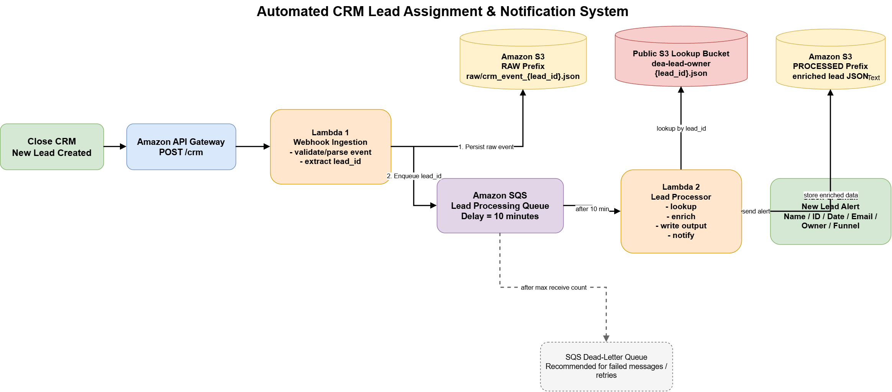

# Real-Time CRM Lead Processing and Notification System

## Overview

This project implements a serverless, event-driven CRM lead processing pipeline using AWS.

When a new lead is created in Close CRM, the system receives the lead through a webhook, stores the original webhook payload in Amazon S3, delays downstream processing for 10 minutes, enriches the lead with updated lead-owner information, stores the enriched record, and sends a real-time Slack notification to the sales team.

The delay allows the CRM sufficient time to assign a lead owner before the enrichment step begins.

---

## Business Problem

In sales-driven organizations, new leads may be created before a sales representative has been assigned.

Immediately processing and notifying the sales team can therefore result in incomplete lead information.

This system solves the problem by:

1. Capturing new lead events in real time.
2. Persisting the raw webhook event.
3. Waiting 10 minutes for CRM owner assignment.
4. Looking up updated lead-owner information.
5. Enriching the original lead record.
6. Persisting the enriched record.
7. Sending a Slack notification containing the final lead information.

---

## Architecture



```text
Close CRM
    |
    | New Lead Webhook
    v
Amazon API Gateway
    |
    v
Ingestion Lambda
    |
    +---------> Amazon S3
    |             raw/
    |
    v
Amazon SQS
10-minute delay
    |
    v
Processor Lambda
    |
    +---------> Lead Owner Lookup
    |           Public S3 Bucket
    |
    +---------> Amazon S3
    |             processed/
    |
    +---------> Slack
    |
    v
Success

Processing failures
    |
    v
Retry
    |
    v
SQS Dead-Letter Queue
````

The editable Draw.io architecture diagram is available under:

```text
architecture/CRM_Lead_Processing_Architecture.drawio
```

---

## AWS Services Used

### Amazon API Gateway

API Gateway exposes the public webhook endpoint used by Close CRM.

Example endpoint:

```text
POST /deploy/crm
```

The endpoint invokes the ingestion Lambda whenever Close CRM sends a new lead event.

---

### AWS Lambda — Ingestion

The ingestion Lambda is responsible for:

* Receiving the webhook request.
* Verifying the Close CRM webhook signature.
* Parsing and validating the payload.
* Verifying that the event represents a newly created lead.
* Extracting lead identifiers.
* Persisting the raw CRM webhook event to S3.
* Sending a lightweight processing message to SQS.

The raw event is persisted before sending the SQS message so that the original source event remains available if downstream processing fails.

---

### Amazon S3 — Raw Layer

The original CRM event is stored before any enrichment or transformation.

Example:

```text
raw/
└── crm_event_lead_123.json
```

Raw storage provides:

* Historical traceability
* Replay capability
* Debugging support
* Recovery from downstream failures
* Reuse for future pipelines or analytics

---

### Amazon SQS

SQS decouples webhook ingestion from downstream processing.

Each new lead is sent to the queue with a 10-minute delay.

This avoids keeping a Lambda execution running during the waiting period and allows the ingestion and processing stages to scale independently.

Example SQS message:

```json
{
  "event_id": "ev_123",
  "lead_id": "lead_123",
  "action": "created",
  "raw_s3_key": "raw/crm_event_lead_123.json"
}
```

The SQS message intentionally contains only the information required to locate and process the lead.

The complete original event remains stored in S3.

---

### AWS Lambda — Processor

The processor Lambda is triggered automatically by SQS after the delay period.

Its responsibilities include:

1. Reading the original CRM event from S3.
2. Looking up updated lead-owner information using `lead_id`.
3. Validating that the lookup record belongs to the same lead.
4. Enriching the CRM event.
5. Storing the enriched record in S3.
6. Sending a Slack notification.

---

## Lead Owner Lookup

Lead-owner information is retrieved using the CRM `lead_id`.

Lookup file format:

```text
https://dea-lead-owner.s3.us-east-1.amazonaws.com/{lead_id}.json
```

Example:

```json
{
  "lead_id": "lead_123",
  "display_name": "John Smith",
  "lead_email": "john@example.com",
  "lead_owner": "Sales Rep A",
  "funnel": "DE ACADEMY Direct VSL",
  "status_label": "Potential",
  "date_created": "2026-09-15T12:00:00+00:00"
}
```

The `lead_id` acts as the join key between the original CRM event and the updated lead-owner data.

Before enrichment, the processor validates that the lookup `lead_id` matches the lead being processed.

---

## Enriched Record

The final enriched record contains information from both the original CRM event and the lead-owner lookup.

Example:

```json
{
  "lead_id": "lead_123",
  "event_id": "ev_123",
  "display_name": "John Smith",
  "date_created": "2026-09-15T12:00:00+00:00",
  "status_label": "Potential",
  "lead_email": "john@example.com",
  "lead_owner": "Sales Rep A",
  "funnel": "DE ACADEMY Direct VSL"
}
```

Processed records are stored under:

```text
processed/
└── crm_event_lead_123.json
```

---

## Slack Notification

After successful enrichment, the Processor Lambda sends a notification to Slack using an Incoming Webhook.

Example:

```text
🚨 New Lead Alert

Name: John Smith
Lead ID: lead_123
Created Date: 2026-09-15T12:00:00+00:00
Label: Potential
Email: john@example.com
Lead Owner: Sales Rep A
Funnel: DE ACADEMY Direct VSL
```

The Slack Webhook URL is stored outside the source code and provided to Lambda through configuration.

---

## Error Handling and Retry Strategy

The system uses SQS retry behavior to handle temporary processing failures.

If the Processor Lambda fails:

```text
SQS message
    |
    v
Processor Lambda
    |
    X Failure
    |
    v
Message becomes visible again
    |
    v
Retry
```

The message is retried according to the SQS visibility timeout and redrive configuration.

After the configured maximum receive count is exceeded, the message is automatically moved to the Dead-Letter Queue.

---

## Dead-Letter Queue

A separate SQS Dead-Letter Queue stores messages that repeatedly fail processing.

```text
crm-lead-processing-queue
        |
        | repeated failures
        v
crm-lead-processing-dlq
```

The DLQ prevents failed leads from being silently lost and allows failed events to be:

* Investigated
* Debugged
* Corrected
* Reprocessed

The retry and DLQ flow was validated using an intentionally missing lead-owner lookup record.

---

## Webhook Security

Incoming Close CRM webhook requests are authenticated using the Close webhook signature.

The ingestion Lambda validates:

```text
Close-Sig-Hash
Close-Sig-Timestamp
```

The expected HMAC-SHA256 signature is calculated from the timestamp and original request body using the Close subscription signature key.

Secure comparison is performed using:

```python
hmac.compare_digest()
```

Webhook events with an invalid signature are rejected before being persisted or sent to SQS.

Secrets such as the Close signature key and Slack webhook URL are not stored in the source code.

---

## Environment Variables

### Ingestion Lambda

```text
RAW_BUCKET
QUEUE_URL
SQS_DELAY_SECONDS
VERIFY_CLOSE_SIGNATURE
CLOSE_SIGNATURE_KEY
```

Example:

```text
RAW_BUCKET=crm-lead-processing-hamed-2026
SQS_DELAY_SECONDS=600
VERIFY_CLOSE_SIGNATURE=true
```

---

### Processor Lambda

```text
DATA_BUCKET
LOOKUP_MODE
SLACK_WEBHOOK_URL
```

Production lookup mode:

```text
LOOKUP_MODE=public_url
```

---

## IAM Security

Each Lambda function uses a separate IAM execution role.

Permissions follow the principle of least privilege.

### Ingestion Lambda

Requires permission to:

```text
s3:PutObject
sqs:SendMessage
CloudWatch Logs
```

### Processor Lambda

Requires permission to:

```text
s3:GetObject
s3:PutObject
sqs:ReceiveMessage
sqs:DeleteMessage
sqs:GetQueueAttributes
CloudWatch Logs
```

The application does not use broad administrator permissions.

---

## Project Structure

```text
crm-lead-processing/
│
├── src/
│   ├── ingestion/
│   │   └── lambda_function.py
│   │
│   ├── processor/
│   │   └── lambda_function.py
│   │
│   └── shared/
│       └── utils.py
│
├── tests/
│   ├── test_ingestion.py
│   └── test_processor.py
│
├── sample_events/
│   └── crm_webhook.json
│
├── architecture/
│   └── CRM_Lead_Processing_Architecture.drawio
│
├── requirements.txt
├── README.md
└── .gitignore
```

---

## Local Setup

Create a virtual environment:

```bash
python -m venv .venv
```

Activate it on Windows PowerShell:

```powershell
Set-ExecutionPolicy -Scope Process -ExecutionPolicy Bypass
.\.venv\Scripts\Activate.ps1
```

Install dependencies:

```bash
pip install -r requirements.txt
```

Current dependencies:

```text
boto3
pytest
```

---

## Running Unit Tests

Run the complete test suite:

```bash
python -m pytest -v
```

Current result:

```text
11 passed
```

The tests cover both ingestion and processing behavior.

---

## Test Coverage

The test suite validates:

### Ingestion

* Lead event extraction
* Successful webhook handling
* S3 raw persistence behavior
* SQS message creation
* Valid Close webhook signature
* Invalid Close webhook signature rejection

### Processor

* Lead enrichment
* Matching lookup validation
* Mismatched lead ID rejection
* Successful end-to-end processing logic
* Lookup failure propagation
* Missing lead ID validation
* Invalid SQS event validation
* Slack notification invocation

AWS dependencies are mocked during unit testing so tests do not require live AWS resources.

---

## End-to-End Validation

The complete pipeline was validated using a real API Gateway request:

```text
HTTP POST
    |
    v
API Gateway
    |
    v
Ingestion Lambda
    |
    +--> Raw S3
    |
    v
SQS
    |
    v
Processor Lambda
    |
    +--> Lead Owner Lookup
    |
    +--> Processed S3
    |
    v
Slack Notification
```

The following behaviors were validated:

```text
Webhook ingestion             PASS
Raw event persistence         PASS
SQS delayed processing        PASS
Automatic Lambda trigger      PASS
Lead-owner enrichment         PASS
Processed S3 persistence      PASS
Slack notification            PASS
Retry behavior                PASS
Dead-Letter Queue             PASS
Webhook signature validation  PASS
Unit tests                    11/11 PASS
```

---

## Reliability Design

Several design decisions improve reliability.

### Decoupled Processing

Ingestion and enrichment are separated using SQS.

A slow or temporarily unavailable downstream system therefore does not block webhook ingestion.

### Durable Raw Storage

The source event is persisted before asynchronous processing begins.

### Retry Support

Processing failures are automatically retried through SQS.

### Dead-Letter Queue

Repeated failures are preserved for later investigation.

### Join-Key Validation

`lead_id` is validated before enrichment to prevent associating one lead with another lead's owner information.

### Independent Lead Processing

Each lead is processed independently, allowing multiple leads to be handled concurrently without requiring global ordering.

---

## Why SQS Instead of Sleeping Inside Lambda?

A Lambda function could technically execute:

```python
time.sleep(600)
```

before processing the lead.

However, that design would unnecessarily keep compute resources active while waiting and tightly couple ingestion with downstream processing.

SQS provides:

* Durable asynchronous buffering
* Decoupling
* Automatic retries
* Parallel processing
* Dead-letter handling
* Better failure isolation

The waiting period therefore occurs in the messaging layer rather than inside an active Lambda execution.

---

## Why Store Raw Data?

The raw CRM event is preserved because it provides:

* Replayability
* Audit history
* Debugging capability
* Recovery from transformation errors
* Support for future downstream pipelines
* Independence from repeated calls to the source CRM

The raw layer acts as the original source record for downstream processing.

---

## Failure Scenario Example

If lead-owner information is unavailable after the delay:

```text
Lead
 |
 v
SQS
 |
 v
Processor
 |
 X Lookup Failure
 |
 v
Retry
 |
 v
Retry
 |
 v
Retry
 |
 v
DLQ
```

The lead is not silently discarded.

---

## Scalability

The architecture is serverless and horizontally scalable.

Multiple independent lead events can be queued and processed concurrently.

API Gateway, Lambda, S3, and SQS scale automatically based on workload.

Because each message represents an independent lead, the pipeline does not depend on strict ordering between different leads.

---

## Observability

Both Lambda functions use structured application logging through CloudWatch Logs.

Key events include:

```text
CRM lead received
Raw event saved
SQS message created
Lead processing started
Owner lookup started
Processed lead saved
Slack notification sent
Lead processing completed
Processing errors
```

These logs provide traceability throughout the pipeline.

---

## Key Engineering Concepts Demonstrated

This project demonstrates practical implementation of:

* Event-driven architecture
* Serverless data pipelines
* Webhooks
* REST APIs
* AWS Lambda
* Amazon S3
* Amazon SQS
* Dead-Letter Queues
* Asynchronous processing
* Delayed processing
* Data enrichment
* Join-key validation
* Retry strategies
* Failure handling
* IAM least privilege
* HMAC webhook authentication
* CloudWatch observability
* Unit testing
* Dependency mocking

---

## Future Enhancements

Potential enhancements include:

* DynamoDB-based idempotency tracking
* Duplicate webhook protection
* Processing-state checkpoints
* AWS Secrets Manager for application secrets
* CloudWatch alarms for DLQ messages
* Infrastructure as Code using Terraform or AWS SAM
* Partial-batch response support for larger SQS batches
* Automated replay tooling for DLQ events
* SNS or EventBridge fan-out for additional downstream consumers

---

## Summary

The system provides a reliable asynchronous workflow for processing newly created CRM leads.

It captures each lead in real time, preserves the original event, waits for CRM owner assignment, enriches the lead using updated owner data, persists the processed result, and notifies the sales team.

The architecture separates ingestion from processing using SQS, allowing the system to handle failures, retries, parallel lead processing, and downstream delays without losing incoming CRM events.

